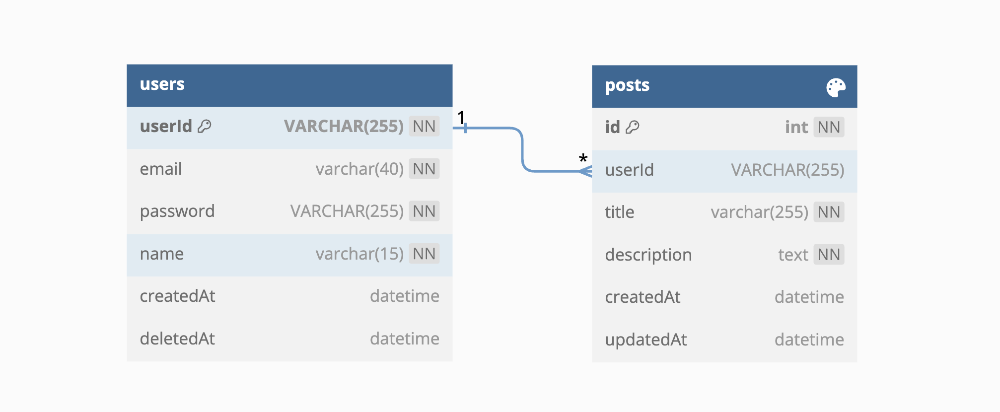
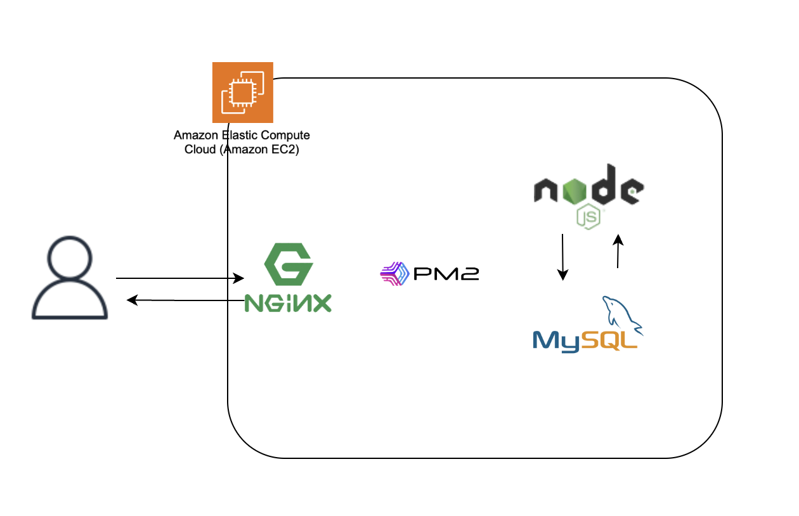

# wanted-pre-onboarding-backend

## 8월 원티드 프리온보딩 백엔드 과제

### 지원자 : 김선희

## 애플리케이션의 실행 방법

### 엔드포인트 호출 방법

- 회원가입(POST) 요청:

  - URL: http://54.180.149.197:3000/signup
    ```bash
    curl --location 'http://54.180.149.197:3000/signup' \
    --data-raw '{
        "email":"test@naver.com",
        "password":"wantedpreonboarding",
        "checkPassword": "wantedpreonboarding",
        "name": "사용자"
    }'
    ```

- 로그인(POST) 요청:

  - URL: http://54.180.149.197:3000/login
    ```bash
    curl --location 'http://54.180.149.197:3000/login' \
    --data-raw '{
      "email": "testUser5@naver.com",
      "password": "adsaaaaa"
    }'
    ```

- 게시물 생성(POST) 요청

  - URL: http://54.180.149.197:3000/posts

    ```bash
      curl --location 'http://54.180.149.197:3000/posts' \
      --header 'Authorization: Bearer userToken' \
      --data '{
          "title": "게시물",
          "description": "게시물입니다."
      }'
    ```

- 게시물 목록 조회(GET) 요청

  - URL: http://54.180.149.197:3000/posts?page={page}

    ```bash
    curl --location 'http://54.180.149.197:3000/posts?page=1' \
    --data ''
    ```

- 특정 게시물 조회(GET) 요청
  - URL: http://54.180.149.197:3000/posts/{id}
    ```bash
      curl --location 'http://54.180.149.197:3000/posts/4' \
    --header 'Authorization;'
    ```
- 특정 게시물 수정(PUT) 요청

  - URL: http://54.180.149.197:3000/posts/{id}

    ```bash
        curl --location --request PUT 'http://54.180.149.197:3000/posts/21' \
      --header 'Authorization: Bearer userToken' \
      --data '{
          "title": "게시물 수정",
          "description": "게시물이 수정됩니다."

      }'
    ```

- 특정 게시물 삭제(DELETE) 요청
  - URL: http://54.180.149.197:3000/posts/{id}
    ```bash
    curl --location --request DELETE 'http://54.180.149.197:3000/posts/21' \
    --header 'Authorization: Bearer userToken'
    ```

## 데이터베이스 테이블 구조



## 구현한 API의 동작을 촬영한 데모 영상 링크

https://www.youtube.com/embed/srpt3sv0un0

## 구현 방법 및 이유에 대한 간략한 설명

- 기술 스택 : JavaScript/Express, TypeScript, MySQL 8.0, AWS EC2
  - TypeScript를 적용하여 예상치 못한 타입 관련 오류 방지
  - 유효성 검사 : joi를 이용하여 validation 적용
  - EC2, NGINX를 이용하여 배포
- 과제 1. 사용자 회원가입 엔드포인트
  - 이메일과 비밀번호, 비밀번호 확인을 입력받아 비밀번호 입력 확인
  - bcrypt 라이브러리를 이용하여 비밀번호 암호화하여 저장
  - userId를 UUID로 저장하여 고유한 사용자의 id값으로 사용
- 과제 2. 사용자 로그인 엔드포인트
  - 로그인시 JWT(JSON Web Token)를 생성하여 사용자에게 반환
- 과제 3. 새로운 게시글을 생성하는 엔드포인트
- 과제 4. 게시글 목록을 조회하는 엔드포인트
  - Pagination 기능을 구현
    - Query로 page를 입력해 게시물 조회
    - cursor(이전 페이지의 마지막 게시물)값을 찾아 cursor 이후 8개의 게시물을 조회
- 과제 5. 특정 게시글을 조회하는 엔드포인트
  - 게시글의 ID를 받아 해당 게시글을 조회
- 과제 6. 특정 게시글을 수정하는 엔드포인트
  - 게시글의 ID를 받아 해당 게시글을 수정
  - Header에 저장된 Token의 userId와 게시글의 userId를 비교해 작성자 검증
- 과제 7. 특정 게시글을 삭제하는 엔드포인트
  - 게시글의 ID를 받아 해당 게시글을 삭제
  - Header에 저장된 Token을 이용하여 작성자 검증

## API 명세(request/response 포함)

### 📌 postman api documentation

https://documenter.getpostman.com/view/22410713/2s9Xy6rqTR

### AWS 배포 환경


