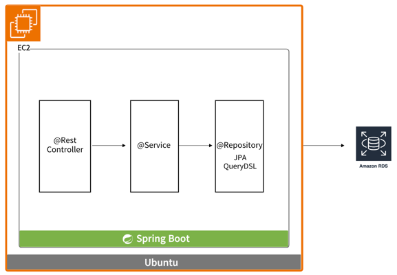
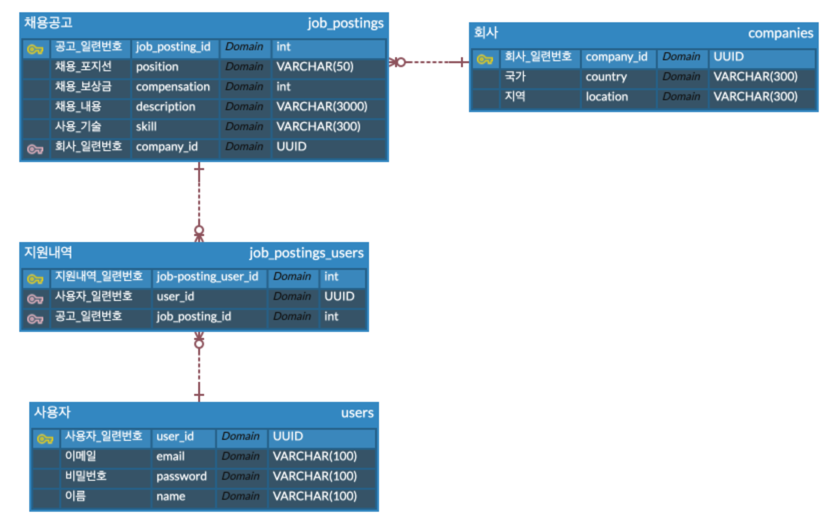

# wanted-pre-onboarding-backend
## SW Architecture

## 개발환경
### Backend
- Java
- Spring Boot
- JPA
- QueryDSL
- Spring Boot Validation
### DataBase
  - H2 Database
  - Maria DB
### Test Framework
  - JUnit5
  - MockMVC
### DevOps
  - AWS EC2
  - AWS RDS

## 개발 상세 내용
### 채용을 위한 웹 서비스
1. 채용공고 등록
2. 채용공고 수정
3. 채용공고 삭제
4. 채용공고 목록
   - 목록
   - 채용공고 검색 기능 구현(선택사항)
5. 채용 상세 페이지
6. 채용공고에 지원(선택사항)
## 데이터 모델링 ERD

## Postman API 문서
      https://documenter.getpostman.com/view/22410713/2sA3rxpYR2
## 느낀점
