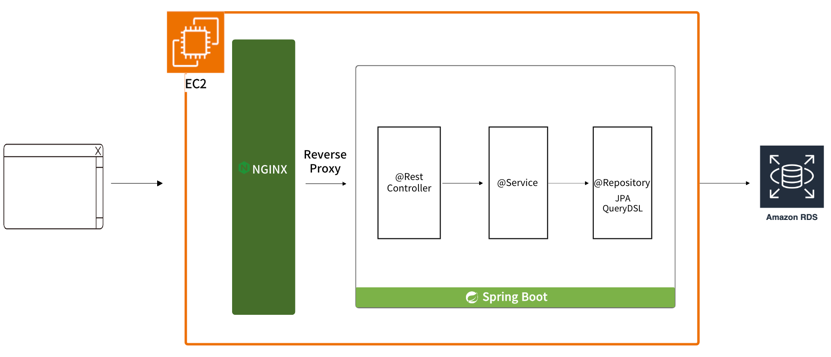
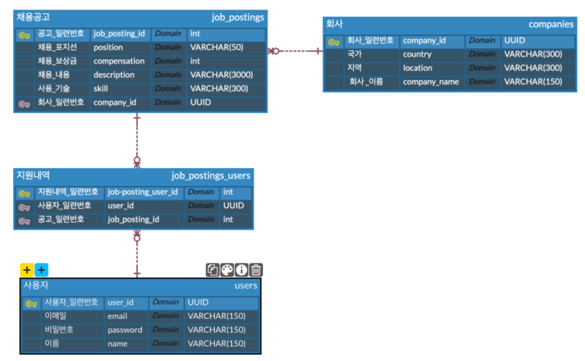
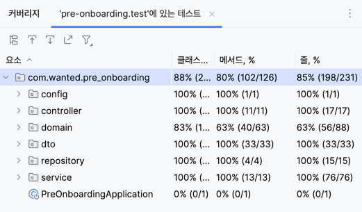

# wanted-pre-onboarding-backend
## 원티드 프리온보딩 백엔드 과제
### 지원자: 김선희
## SW Architecture

## 개발환경
### Backend
- Java
- Spring Boot
- JPA
- QueryDSL
- Spring Boot Validation
### DataBase
  - H2 Database
  - Maria DB
### Test Framework
  - JUnit5
  - MockMVC
### DevOps
  - AWS EC2
  - AWS RDS
  - NginX

## 개발 상세 내용
### 채용을 위한 웹 서비스
1. 채용공고 등록
2. 채용공고 수정
3. 채용공고 삭제
4. 채용공고 목록
   - 목록
   - 채용공고 검색 기능 구현(선택사항)
5. 채용 상세 페이지
6. 채용공고에 지원(선택사항)
## 데이터 모델링 (ERD)

## API 명세서(Postman)
https://documenter.getpostman.com/view/22410713/2sA3rxpYR2

## 후기
### 목표
- 프리온보딩 백엔드에 지원하며, 인턴십에 참여하여 이전에 참여했던 java 개발 교육에서 더 심화된 기술을 습득하고, 백엔드 개발자로 취업할 수 있는 역량을 기르고 싶었습니다.
- 프리온보딩 인턴십에 선발되지 못하더라도 직전 프로젝트에서 아쉬웠던 점들을 최대한 적용하여 좀 더 성장하는 기회로 삼고자 합니다.
### 배포
- Nginx를 이용한 Reverse Proxy 구성
- 무중단 배포 환경 구성
### 테스트 코드
- DB의 데이터에 영향을 받지 않는 신뢰성 있는 테스트 작성
  - H2 인메모리 데이터베이스를 활용, 테스트 DB를 별로 구성
  - DB에 데이터가 없는 것을 가정하고 데이터 삽입부터 구현까지 진행하여 신뢰성 확보
- Assertj를 사용, 자체 검증 가능한 테스트 구현
- 다른 메서드에 의존하지 않는 단위테스트 작성
- controller, dto, repository, service의 테스트 커버리지 100% 달성

### validation
- domain, dto에서 각각 validation 진행하여 데이터 무결성 강화

### exception
- @RestControllerAdvice를 활용한 전역 예외처리
